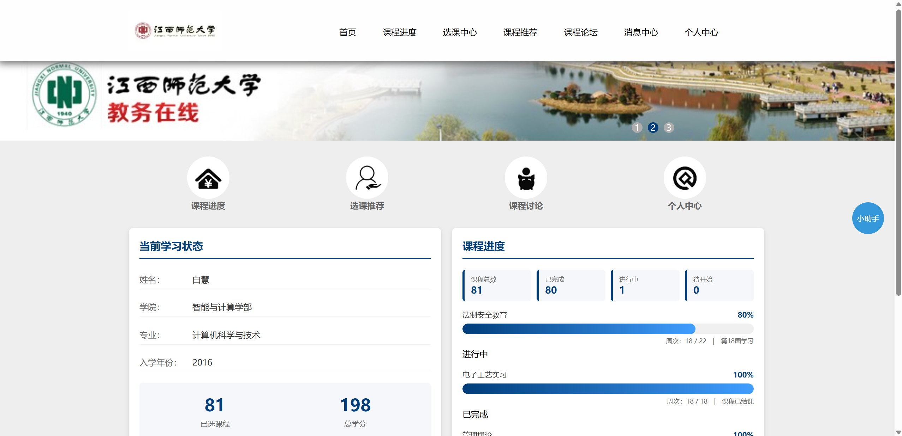
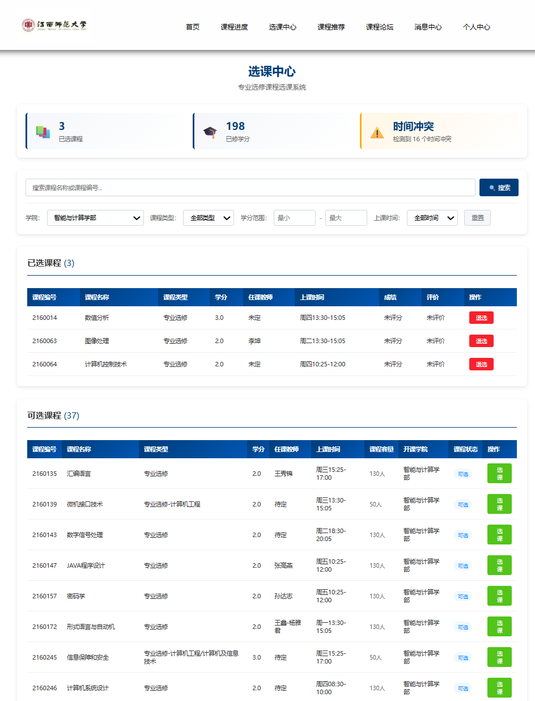
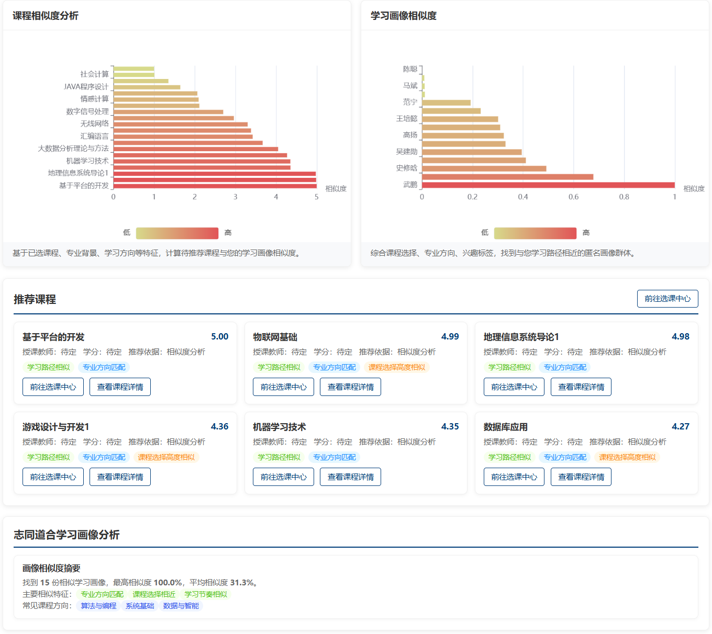
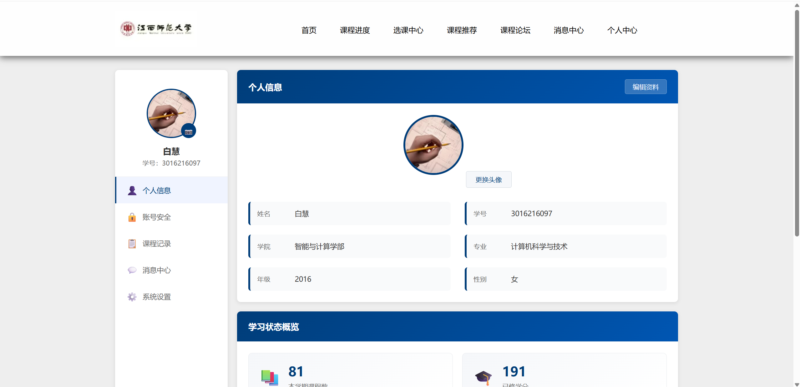

## 学生培养计划可视化系统

一个集培养计划可视化、课程推荐、论坛讨论为一体的教学辅助平台，帮助学生掌握个人学业进度，也便于管理员集中维护学生数据。

### 功能概览
- 可视化培养计划树与学分统计，实时掌握完成情况；
- 基于 SVD 的课程推荐，按相似学生行为给出个性化建议；
- 课程论坛与讨论区，支持发帖与回复；
- 选课/退课模拟，便于提前规划修读路径；
- 管理员可维护学生基础信息、登录记录等。

### 技术栈与依赖
- Python 3.8+
- MySQL 5.7+
- Flask 1.0+
- numpy
- pymysql
- openai（仅在启用 AI 助手时需要设置 `DEEPSEEK_API_KEY`）

安装依赖示例：
```bash
pip install Flask numpy pymysql openai
```

### 项目结构
```
├── main.py                # Flask 入口
├── utils/                 # 数据查询、推荐等工具
├── templates/             # HTML 模板
├── static/                # 前端静态资源
├── sql/                   # 数据库脚本
├── config.py              # 基础配置
└── errors.py
```

## 快速开始

1. **克隆项目**
   ```bash
   git clone https://github.com/gsolvit/studentTrainPlan.git
   cd studentTrainPlan
   ```

2. **准备数据库（必须使用 `utf8mb4` 防止中文插入报错）**
   ```sql
   mysql -u root -p
   SET NAMES utf8mb4;
   SET CHARACTER SET utf8mb4;

   DROP DATABASE IF EXISTS studenttrainplan;
   CREATE DATABASE studenttrainplan CHARACTER SET utf8mb4 COLLATE utf8mb4_unicode_ci;
   USE studenttrainplan;

   SOURCE sql/schema.sql;
   SOURCE sql/insert_student.sql;
   SOURCE sql/insert_loginformation.sql;
   SOURCE sql/insert_education_plan.sql;
   SOURCE sql/insert_choose.sql;
   SOURCE sql/insert_edu_stu_plan.sql;
   ```
   > 如果遇到 `Data too long` 或 `Incorrect string value`，请确认上述字符集命令已执行，且 SQL 文件保存为 UTF-8。

3. **配置数据库连接**
   编辑 `config.py`：
   ```python
   config = {
       'default': Config,
       'MYSQL_PASSWORD': '你的MySQL密码',
       'DATABASE_NAME': 'studenttrainplan'
   }
   ```

4. **启动服务**
   ```bash
   python main.py
   ```
   浏览器访问 [http://localhost:5000](http://localhost:5000) 即可。

## 默认账号
| 角色 | 账号 | 密码 | 说明 |
| ---- | ---- | ---- | ---- |
| 管理员 | `admin` | `123456` | 拥有学生信息增删改权限 |
| 学生示例 | `3016216097` | `3016216097` | 其余学生账号密码均为学号 |

管理员登录后会跳转到 ` /manager `，普通学生登录后进入首页并可访问个人中心、推荐等模块。

## 常见问题
- **ERROR 1366 / 1406**：99% 是字符集未设置为 `utf8mb4`。重新执行 `SET NAMES utf8mb4;` 并重新导入。
- **无法连接数据库**：确认 `config.py` 中密码与本地 MySQL 一致，确保 MySQL 已启动。
- **AI 助手报错**：需要在系统环境变量中设置 `DEEPSEEK_API_KEY`；若不使用该功能，可忽略相关按钮。

## 部署
可参考作者的 [CSDN 博客](https://blog.csdn.net/qq_40423339/article/details/86606308#commentsedit) 或自行将 Flask 应用部署到常见 PaaS / 服务器。

## 界面预览




